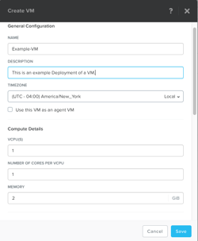
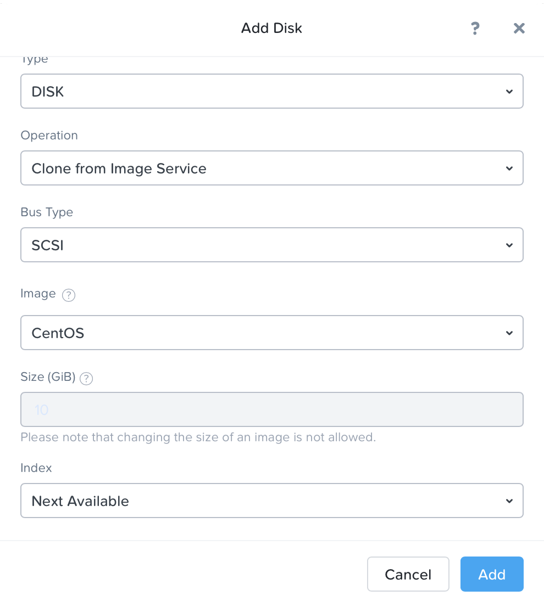
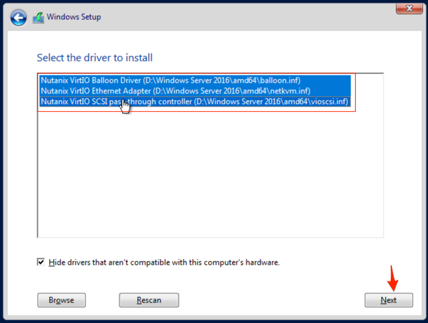

.. _lab_deploy_workloads:

-------------------------
实验-工作负载部署
-------------------------

创建Linux VM
+++++++++++++++++++

从Prism Central部署Linux VM

在**Prism Central > Explore > VMs**, 点击**Create VM**.

按提示填写以下字段，然后点击**Save**:

- **Name** - Linux_VM-*initials*
- **Description** - (Optional) Description for your VM.
- **vCPU(s)** - 1
- **Number of Cores per vCPU** - 1
- **Memory** - 2 GiB

- 选择**+ Add New Disk**
    - **Operation** - Clone from Image Service
    - **Image** - CentOS
    - Select **Update**
    - Select **Add**
    

- 选择**Add New NIC**
    - **VLAN Name** - Primary
    - Select **Add**

点击**Save**以创建VM.

创建Windows VM
+++++++++++++++++++++

从Prism Central部署Windows VM
.. note::
  
    Nutanix提供了一组与VMware Tools类似的用户工具和驱动程序。
    要安装基于Windows的操作系统，必须在安装时提供Virtual I/O驱动程序，否则虚拟机无法识别到虚拟磁盘。 
    Nutanix为AHV上的Windows操作系统提供了一组定制的Virtual I/O驱动程序。
    

在**Prism Central > Explore > VMs**, 点击**Create VM**.

按提示填写以下字段，然后点击**Save**:

- **Name** - Windows_VM-*initials*
- **Description** - (Optional) Description for your VM.
- **vCPU(s)** - 2
- **Number of Cores per vCPU** - 1
- **Memory** - 4 GiB
- 选择**+ Add New Disk**
    - **Type** - DISK
    - **Operation** - Clone from Image Service
    - **Image** - Windows2012
    - Select **Add**

- 选择**+ Add New Disk**
    - **Type** - CDROM
    - **Operation** - Clone from Image Service
    - **Image** - Nutanix VirtIO
    - Select **Add**

- 选择**Add New NIC**
    - **VLAN Name** - Primary
      - Select **Add**

点击**Save**以创建VM.

现在让我们试试启动VM:

选择要启动的VM，然后从**Actions**下拉菜单中单击**Power On**

接下来打开一个控制台会话：

选择VM，然后从**Actions**下拉菜单中单击**Launch Console**。

根据提示进行下一步操作并等待安装进度到需要选择Windows安装路径的界面，此时系统安装进程会提示无法找到硬盘

选择**Load Driver**，并选择找到Nutanix VirtIO挂载的CD目录。

浏览CD的目录，并选择与要安装的Windows操作系统版本一致的目录。

.. figure:: images/deploy_workloads_05.png

.. figure:: images/deploy_workloads_06.png

选择显示的三个Nutanix驱动程序 (按住Ctrl键并选择所有三个驱动程序):

- Balloon
- Ethernet adapter
- SCSI passthrough controller

点击下一步.

正常加载驱动程序后，步骤1中创建的磁盘将显示为安装目标。选择该磁盘并继续正常安装过程。

安装完成后，可以卸载Windows安装ISO，并可以从VM中删除用于驱动程序的其他CD-ROM。

.. note::

  在ESXi中：
  
   - 通过VMware vSphere创建VM后，它将显示在Prism VMs列表中。
   - 或者，如果通过Prism创建VM，它将显示在VMware vSphere UI中。
   示例如下图所示。
   .. figure:: images/deploy_workloads_08.png

小贴士
+++++++++

 - 在本实验中，您可以看到部署Linux VM和Windows VM非常简单。
 - 镜像配置工具允许您根据需要可创建一个用于VM部署的可用映像服务目录，并涵盖包括qcow，qcow2，vmdk，VHD，VHDx，RAW和ISO的广泛格式支持。
